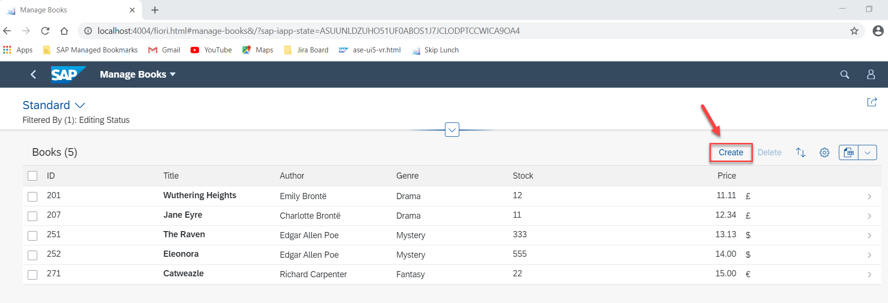
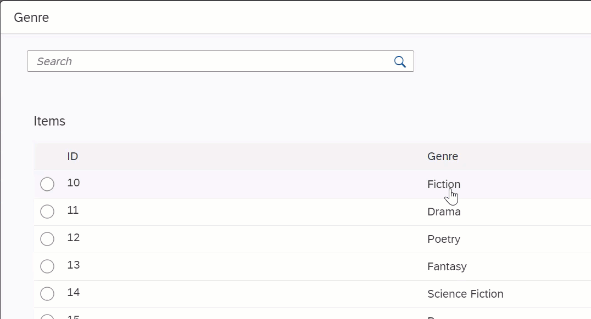
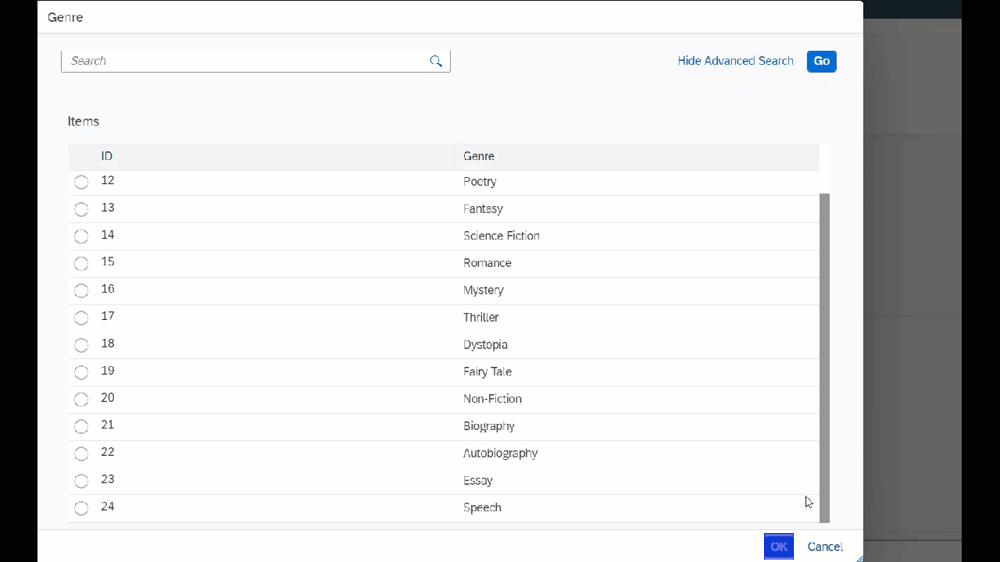
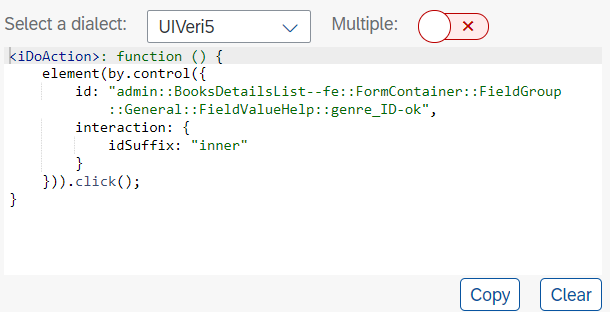
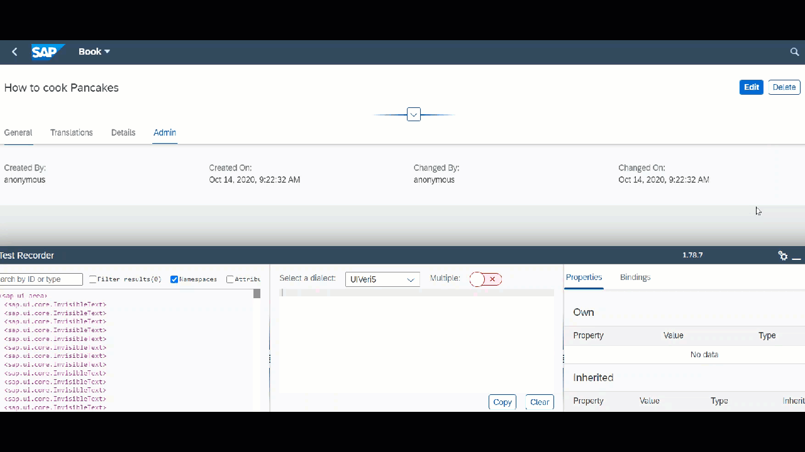
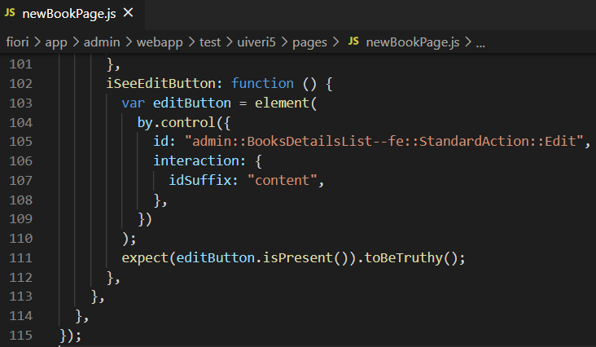
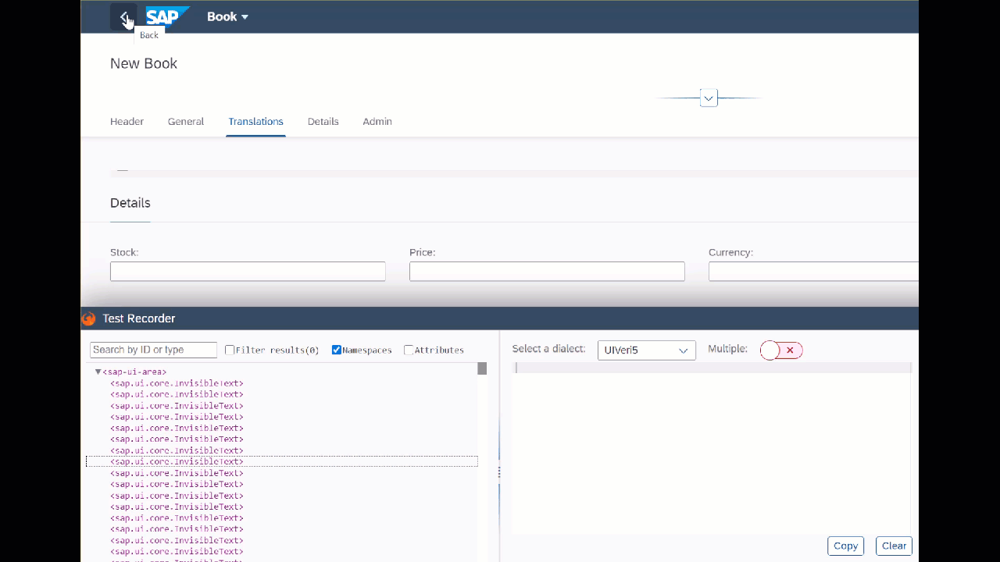

## Prerequisites
- You use SAPUI5 in version 1.74 or higher.
- You have installed and configured a local Git client.
- You have installed Docker in version 18.09.6 or higher.
- You have installed Node JS in version 8.0 or higher.
- You have installed Visual Studio Code.
- You have installed UIVeri5 using the following command:
  
```shellscript
npm install @ui5/uiveri5 -g
```

- You have installed cds command line tools using the following command:

```shellscript
npm install -g @sap/cds-dk
```

## Details

### You will learn
- How to create system tests with UIVeri5 using the UI5 Test Recorder
- How to create a CI/CD pipeline with project “Piper”
- How to add system tests as automated steps to your CI/CD pipeline

### What Is This Tutorial About?

In this tutorial, you’ll create and run automated system tests with UIVeri5 against a simple CAP based app for a bookshop. Your test application has basic functions such as creating a new book.

The tutorial consists of three main stages:

1. Clone CAP based application and manually go through your test scenario before starting to code it.

2. Create and run system tests with UIVeri5 to add a new book and check if it is displayed in the list of books.

3. Automate your system tests by integrating them into a CI/CD pipeline.

### About System Tests with UIVeri5
UIVeri5 is an SAP open-source JavaScript testing framework for SAPUI5 applications. It drives a real browser for your deployed app and simulates authentic user scenarios. System tests check both frontend and backend and make sure that all pieces of an application work well together.

### About the SAPUI5 Test Recorder
The SAPUI5 Test Recorder is a tool that helps you create integration and system tests. You can use it in any SAPUI5 application to inspect its user interface, view the control properties, and get code snippets for OPA5 and UIVeri5 tests. As of version 1.74, it is part of the SAPUI5 framework.

For more information about the SAPUI5 Test Recorder  [See Test Recorder](https://sapui5.hana.ondemand.com/#/topic/2535ef9272064cb6bd6b44e5402d531d) 

### About CI/CD with Project “Piper”

Project “Piper” is one of SAP’s solutions for continuous integration and delivery. It provides pre-configured Jenkins pipelines, which you can use in your own Jenkins master infrastructure and adapt according your needs. Project “Piper” consists of two different parts:

- A [shared library](https://sap.github.io/jenkins-library/), which contains the description of steps, scenarios, and utilities that are required to use Jenkins pipelines
- A [set of Docker images](https://github.com/SAP/devops-docker-images) that can be used to implement best practice processes

## Step 1: Set up CAP based bookshop application  

In Visual Studio Code, set up your application under test.

1. Open Visual Studio Code.
2. Choose **View** **→** **Command Palette…** **→** **Git:Clone**.
3. As **Repository URL**, enter:

```shellscript 
git@github.wdf.sap.corp:d059035/TechEd-2020.git
```
4. Select a folder of your choice into which to clone the test repository by choosing **Select Repository Location**.

5. When asked if you would like to open the cloned repository, choose **Open**.

6. As a result, the project `Bookshop-UIVeri5` is loaded into the **EXPLORER** panel and you can see its resources in the outline:

   **add screenshot**   **changes**

7. Install npm packages by:
```
cd Bookshop-UIVeri5
npm install
```

 #### Running bookshop app

For a completely automated jumpstart, execute the following commands:

 ```shellscript
 cd fiori
 cds watch
 ```
 ### Console output would be as follows: 


 ## Step 2: Set up UIVeri5 tests

### Writing system tests with UIVeri5 for the bookshop app

1. General structure of UIVeri5 Tests:

- (a) The `conf.js` file:

  In this file, you can define, for example, the browser and reporter that are used, the base URL, and the credentials for your login dialog. In your case, you just need to mention the base URL.

- (b) The `spec.js` file (in this case, it’s called `teched.spec.js`):

  In this file, you’ll define your test scenario, which comprises steps that are triggered one after the other. Within the test scenario, you’ll refer to your page objects.

- (c) Page objects (in this case, you have `manageBooks.js` for the list of books that are added and a create button to create new book.  There is another page object `newBook.js`  to add complete details about the book):

  Page objects are design patterns that represent a significant part of an app, for example, a view. They group two kinds of elements:

  - Actions, for example, clicking on the button to create new book.
  - Assertions, for example, checking if the newly created book is displayed in the list of books.

  Page objects use [locators](https://github.com/SAP/ui5-uiveri5/blob/master/docs/usage/locators.md) to identify specific elements on the screen. Thereby, they allow test runners to see and do anything a real user would. Page objects reside in the `pages` folder of your project.

2. Open the `conf.js` file.

   In this file, you’ll define the base URL of your test application

3. Add the following line into the `exports.config` property to open the manage book app:

   ```
   baseUrl: "http://localhost:4004/fiori.html#manage-books",
   ```

Now, your project setup is ready. Make sure that your code looks as follows and choose **File** **→** **Save**.


### **Step 2: Walk through the test scenario**

Manually, familiarize yourself with your test scenario before starting to code it. Later, you’ll automate the following steps so that they are automatically executed during your system tests.

1. Since your bookshop application is running on your local server, use the following URL to access the bookshop application:

   ```
   http://localhost:4004/fiori.html#manage-books
   ```

2. Click on create button.

   
  
3. Enter the title of the book.

  


4. Click on the Genre drop-down and choose value "Fiction".

5. Click on Author drop-down and choose value "Emile Bronte".
  
6. Click on Save button on bottom right.
7. Verify that the Edit button on top right is displayed.
8. Click on back button to return to the list of books.
9. Verify that the new book has been added to the list.


## Step 3: Create UIVeri5 script to add a new book 
In this exercise you will extend the Test Scripts file named as "teched.spec.js". This file contains one describe-block, and it-block. **"describe"** is like a test suite, that holds a set of test cases that are called **"it"**. We can have multiple "it" blocks in a single spec file. 

1. From the **EXPLORER** panel in Visual Studio Code, open `teched.spec.js`.

    In this file, you’ll define the steps of your test scenario and within them, refer to your page objects.

2. Implement the `it` function by adding the skeleton of the create new book test:

   ``` javascript
   it("create a new book", function () {
   
    });
   ```

   Your code should now look as follows:

   

3. As a first step to create a new book, you have to click on create new button. Implement the following code in the "it" block

    ``` javascript
      When.onTheManageBooksPage.iClickOnCreateNewBook();
   ```

`iClickOnCreateNewBook()` is a reference to the test function that you’ll define in the following.

After each step make sure to save changes by choosing **File** **→** **Save**.


4. From the **EXPLORER** panel, open `pages` **→** `manageBooksPage.js`.

​      This file represents the page object for your manage books app. In page objects, you can define actions that are performed        during a test and make assertions 


5. In the BookShop application in Google Chrome, press **CTRL** + **SHIFT** + **ALT** + **T** (if you use a Windows system) or **SHIFT** + **CTRL** + **OPTION** + **T** (if you use a Mac system) to open the Test Recorder in a new browser window.It can take a short while until the Test Recorder browser window is displayed 


6. In your sample application, right-click on the **Create Button** and choose **Highlight**. As a result, the Test Recorder highlights the entry to indicate its activity:

    


Now, the Test Recorder provides a code snippet for your test:


```
Please make sure that the dialect "UIVeri5" is selected.
```


7. Copy this code snippet into the actions section of your `manageBooksPage.js` page object. As you pass the title in the spec file, you need to define the page object action accordingly and slightly adapt the code snippet

 


8. Now the first action is defined, let us continue with the next page object

   --------------------------------------------------------------

   **Adding all the details for a new book**

   1. From the **EXPLORER** panel in Visual Studio Code, open `teched.spec.js`.

   2. Next, add details for the new book, from the **EXPLORER** panel, open `pages` **→** `NewBookPage.js`.

   3. As a first action, you have to enter the title of the book. Implement the below in the "it" block. bookTitle is a variable that you have declared before and pass as an argument here. 
 ```javascript
    When.onTheNewBookPage.iEnterTitle(bookTitle);
 ```
Declare bookTitle variable and assign value "How to cook Pancakes"

``` javascript
    let bookTitle = "How to cook Pancakes";
```
Your code will look as follows:        

 

4. From the **EXPLORER** panel, open `pages` **→** `newBookPage.js`.
5. In your bookshop application, right-click the Title input field and choose **Enter Text**. As a result, the Test Recorder highlights the input field to indicate its activity:
6. 

Now, the Test Recorder provides a code snippet for your test:


7. Copy this code snippet into the `actions` section of your `newBookPage.js`. 


------------------------------------------------
Now we choose a value from drop down and it has three actions in combination.

8. From the **EXPLORER** pane, open `teched.spec.js`  and implement the below action in the "it" block
 ``` javascript
 it("create a new book", function () {
    When.onTheManageBooksPage.iClickOnCreateNewBook();
    When.onTheNewBookPage.iEnterTitle(bookTitle);
    When.onTheNewBookPage.iSelectGenre();
 }
 ```


9. In your bookshop application, right-click the Genre drop down and choose "Press". As a result, the Test Recorder highlights the drop down icon to indicate its activity:

   

Now, the Test Recorder provides a code snippet for your test:


10. After clicking on the drop down, choose the value from the values pop up. Use again the Test Recorder to identify a suitable code snippet. **The step to copy the snippet and paste it to the actions in the page objects is missing here**





11. Copy this code snippet into the `actions` section of your `newBookPage.js`. 
  
12. After selecting the value click on OK button
  
    




1.Copy the generated snippet 

  




6. You can combine the above three actions and the code will now look as follows
  
  
---------------------------------------------------------------

-----------------------------------

7. Similarly you can repeat the process of selecting the Author and the code will look as follows:


8. Now to click on Save button. Right click the save button and press click event. Copy the generated snippet into the `actions` section of your `newBookPage.js`. 

   

   


9. To ensure save action is correct, verify that edit button is displayed. Add the expected behavior into the teched.spec.js


10. Implement `iSeeEditButton` in `NewPageObject`

   

11. Copy the snippet in Page object

    ```javascript
    iSeeEditButton: function () {
            var editButton = element(
              by.control({
                id: "admin::BooksDetailsList--fe::StandardAction::Edit",
                interaction: {
                  idSuffix: "content",
                },
              })
            );
            expect(editButton.isPresent()).toBeTruthy();
          },
    ```

    Code will now look as follows:

    

12. 

13. Now to click on Back button. Right click the back button and press click event. Copy the generated snippet into the `actions` section of your `newBookPage.js`. 

    

​     Code will look as follows:


10.


---------------------------------


## Integrate system tests as automated steps to your CI/CD pipeline

Make sure that Docker is running on your local machine.

For Linux and Mac users:

In this step you first have to set up a local Jenkins instance. To do this we will run a docker image which contains all requirements. Just execute the following command: 
```shellscript
docker run -it --rm -u $(id -u):$(id -g) -v "${PWD}":/cx-server/mount/ ppiper/cx-server-companion:latest init-cx-server
```

When the docker command is finished, you will find a new folder created on your local file system. There you can find configurations which are used by `cx-server` to start the Jenkins instance. 

Then this command will start a CX Server which contains Jenkins instance. 

Then navigate to the newly created `cx-server` folder and start the cx-server with executing the following command:
```shellscript
chmod +x ./cx-server
./cx-server start
```
This will configure right permissions on the files and then will start the Jenkins. Just wait to see success message on the console.

When Jenkins is up and running, a credentials for the `admin` user will be generated. To fetch them, just execute:
```shellscript
 ./cx-server initial-credentials
```

For Windows users:

First you have to configure your docker - make sure docker will have enough memory for normal operation. To do this excersice your docker should have available at least 4GB memory. To configure it follow the next steps:
- Open the Docker Desktop menu by clicking the Docker icon in the Notifications area (or System tray):


- Select Settings to open the Settings dialog:


- Select `Resources` and extend the memory to at least 4GB:


Then you have to configure FileShare permissions to a folder from your local file system. Just choose a folder and go to File Sharing to add permissions:


In this step you first have to set up a local Jenkins instance. To do this we will run a docker image which contains all requirements. Just execute the following command and replace with the path of the folder which you set the permissions: 
```shellscript
docker run -it -v <path_to_folder>:/cx-server/mount/ ppiper/cx-server-companion:latest init-cx-server
```

When the docker command is finished, you will find a new folder created on your local file system. There you can find configurations which are used by `cx-server` to start the Jenkins instance. 

Then this command will start a CX Server which contains Jenkins instance. 

Then navigate to the folder which you provided and start the cx-server with executing the following command:
```shellscript
cx-server.bat start
```
This command will start the Jenkins. Just wait to see success message on the console.

When Jenkins is up and running, a credentials for the `admin` user will be generated. To fetch them, just execute:
```shellscript
 cx-server.bat initial-credentials
```

##### Now you should have running Jenkins on your localhost.

When you have the credentials for the `admin` user, you are ready to login. Open your browser and navigate to `http://localhost`, then login with username `admin` and the password which you received from the previous command. 

Now we have Jenkins instance running on localhost and we are ready to start with pipeline creating. To do this, please follow the following steps.

Create new pipeline:
- Go to Jenkins
- Login
- Click on New Item
- Enter name for your new pipeline: `TechEd-2020`
- Select project type to be `Pipeline` and then OK button.
- Scroll down to the "Pipeline" section.
- Select Pipeline Definition to be from `Pipeline script from SCM`.
- On SCM, select `Git`.
- Provide git clone url to your repository in GitHub.
- Leave all other fields with the default values.
- Save the pipeline
- Build it


  **Congratulations!**

You have successfully created different system tests with UIVeri5 and integrated them into a continuous integration and delivery pipeline.


